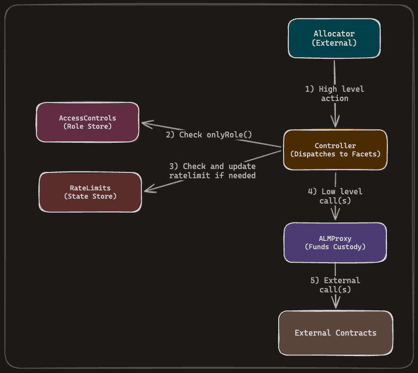
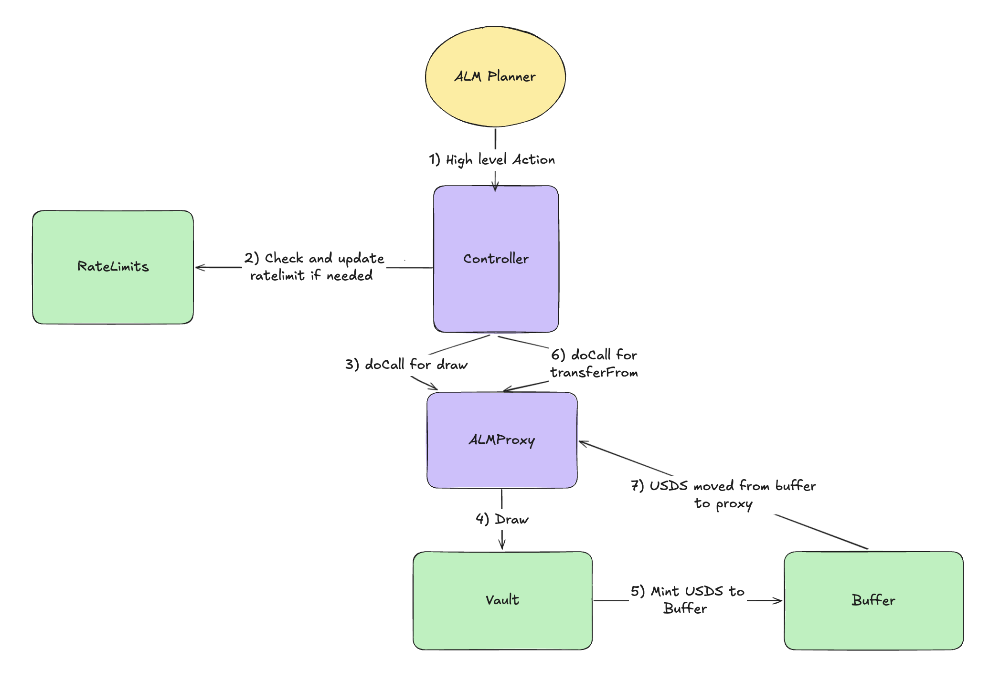
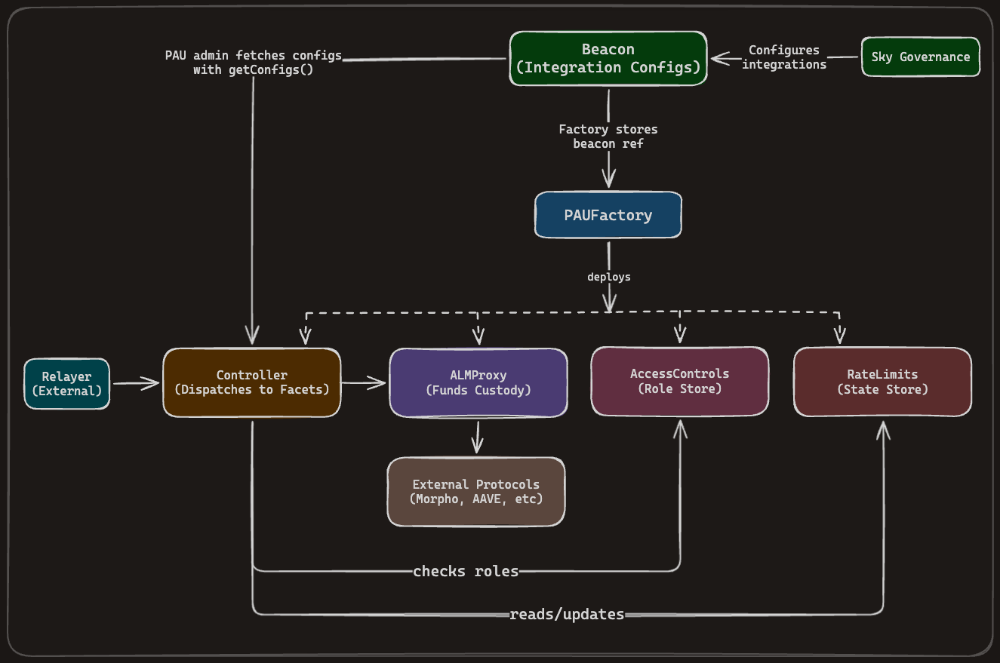

# Architecture

This document describes the architecture of the PAU system.

## Core Contracts

### ALMProxy

The proxy contract that holds custody of all funds. This contract routes calls to external contracts according to logic within a specified `controller` contract.

**Key characteristics:**

- Stateless except for ACL logic (OpenZeppelin `AccessControl`)
- Allows future iterations in logic by onboarding new controllers
- New controllers can route calls through the proxy with new logic

### Controller

The unified controller contract that serves as the entry point for all allocator operations. Inspired by the [EIP-2535 Diamond Proxy](https://eips.ethereum.org/EIPS/eip-2535) pattern, the Controller uses dispatch-based routing to delegate calls to specialized facets. Rather than maintaining separate controllers per domain (e.g., mainnet vs L2), a single Controller is deployed on each chain and configured with only the facets relevant to that deployment.

**Key characteristics:**

- Dispatch-based call routing: admin syncs integration configs from the Beacon via `updateIntegrations`, which maps call selectors to (facet address, delegate selector) pairs locally
- Each facet uses its own ERC-7201 namespaced storage domain, preventing storage collisions
- Shared state (access controls, proxy, rate limits) is accessible to all facets via `ControllerSharedStorage`
- Reentrancy protection defined in individual facets
- Enumerable introspection via `integrations()`, `getConfig()`, `getConfigs()`, `getDispatch()`, and `getDispatches()`

**Capabilities (determined by which facets are wired):**

- Interact with the Sky allocation system to mint and burn USDS
- Swap USDS to USDC in the PSM
- Deposit, withdraw, and swap assets in L2 PSMs
- Interact with external protocols (Aave, ERC-4626 vaults, Curve, Uniswap, etc.)
- Bridge USDC via CCTP and OFTs with LayerZero
- Transfer shares via Centrifuge cross-chain

### Beacon

The Beacon manages all data related to integrations (facet address + wire mappings) and stores the canonical dispatch lookup. Multiple Controllers can reference the same Beacon, each syncing its local config copy via `updateIntegrations`. The Beacon admin (`DEFAULT_ADMIN_ROLE`) configures integrations, and the Beacon validates facet addresses, prevents duplicate selector wiring, and protects hardcoded Controller selectors. Controllers use this syncing pattern to opt in to upgrades from the Beacon.

See [BEACON.md](./BEACON.md) for data structures, integration lifecycle, hardcoded selector protection, and versioning details.

### PAUFactory

Factory contract for deploying complete PAU systems. Takes a Beacon address at construction. The `deploy` function atomically creates an `ALMProxy`, `RateLimits`, `AccessControls`, and `Controller` (pointing to the shared Beacon), wires their roles, and transfers admin ownership to the caller-specified admin. Existing PAU systems that will upgrade to use the new controller do not have to deploy from the factory. This factory is to make PAU deployments more convenient for new systems.

### AccessControls

A thin extension of OpenZeppelin `AccessControlEnumerable`. The constructor grants `DEFAULT_ADMIN_ROLE` to the configured admin (reverts on a zero address). Role grants and revocations follow standard OpenZeppelin semantics, each role's admin can grant or revoke it, with `DEFAULT_ADMIN_ROLE` as the admin for every role by default. The only PAU-specific addition is `setRoleAdmin(role, adminRole)`, an external wrapper around OZ's internal `_setRoleAdmin` gated by `DEFAULT_ADMIN_ROLE`, which lets governance delegate the admin of any role (for example, making a custom `ALLOCATOR_ADMIN_ROLE` the admin of `ALLOCATOR_ROLE`). No PAU-specific roles, custom role-revoker logic, or emergency-revocation helpers are baked into this contract. Use cases that need custom role granters or revokers (for example, a freezer that can revoke a compromised allocator outside the governance path) should be implemented as separate modules layered on top of `AccessControls`. The module holds the custom role logic, is granted the relevant admin role, and calls into `AccessControls` to perform grants and revocations. For example, a party that wants asymmetric thresholds (a low-threshold multisig that can only revoke roles for fast incident response, and a high-threshold multisig that can grant roles via slower governance) can implement that policy in a custom module on top of `AccessControls`, granting the module the relevant admin role and exposing only the desired grant/revoke entry points to each multisig. A separate contract was used here to make facet development easier (external call to a module vs. maintaining ACL storage across all facets).

### RateLimits

Contract used to enforce and update rate limits on the Controller.

**Key characteristics:**

- Stateful contract storing rate limit data
- Uses `keccak256` hashes to identify functions for rate limiting
- Allows flexibility in future function signatures while maintaining the same high-level functionality

See [RATE_LIMITS.md](./RATE_LIMITS.md) for detailed rate limit documentation.

### ALMProxyFreezable

A variant of the `ALMProxy` that is not intended to hold funds or have critical authority. It defines low-risk parameters within the PAU ecosystem.

**Architectural differences from standard ALMProxy:**

- **Controller role usage:** In the standard `ALMProxy`, the controller is the `Controller` contract that acts when approved allocators interact with it. In `ALMProxyFreezable`, the allocators are granted the `ALLOCATOR_ROLE` role directly (there is no intermediary Controller contract), so they can call `doCall` and `doCallWithValue` without a Controller.
- **Additional safety mechanism:** The `FREEZER_ROLE` role can remove allocators via `removeAllocator`, providing quick revocation of access from compromised or malicious allocators without slower governance processes.

### OTCBuffer

Buffer contract used for OTC swap operations. See [LIQUIDITY_OPERATIONS.md](./LIQUIDITY_OPERATIONS.md#otc-buffer-configuration) for details.

### WEETHModule

Module contract used for facilitating NFT-based WEETH withdrawals. See [WEETH_INTEGRATION.md](./WEETH_INTEGRATION.md) for details.

## Architecture Diagrams

### General Call Flow

The general structure of calls is shown below. The `Controller` is the entry point for all calls. It dispatches to the appropriate facet, which checks rate limits if necessary and executes the relevant logic. Facets perform calls to the `ALMProxy` contract atomically with specified calldata.

  

### Example: Minting USDS

The diagram below provides an example of calling to mint USDS using the Sky allocation system. Note that funds are always held in custody by the `ALMProxy` as a result of the calls made.

  

## Permissions

All contracts except `Controller`, `PAUFactory`, `ControllerSharedStorage` and the facets (via
`Facet`) inherit and implement the `AccessControl` contract from OpenZeppelin to manage permissions. `Controller`, `PAUFactory`, `ControllerSharedStorage` and the facets (via
`Facet`) do not inherit `AccessControl` directly, they rely on an external `AccessControls`
contract for role checks. The following roles are defined:

| Role                 | Description                                                                                                                                                                      |
| -------------------- | -------------------------------------------------------------------------------------------------------------------------------------------------------------------------------- |
| `DEFAULT_ADMIN_ROLE`   | Admin role that can grant and revoke roles. Also used for general admin functions in all contracts.                                                                              |
| `ALLOCATOR_ROLE`       | Used for the offchain allocator system. Can call functions on controller contracts to perform actions on behalf of the `ALMProxy`.                                               |
| Allocator role admin   | Whichever role governance sets as the admin of `ALLOCATOR_ROLE` via `accessControls.setRoleAdmin`. That role can grant and revoke `ALLOCATOR_ROLE`. Defaults to `DEFAULT_ADMIN_ROLE` and is expected to be delegated to a custom module that implements the desired grant/revoke policy. |
| `CONTROLLER`           | Used for the `ALMProxy` contract. Only the `Controller` with this role can call the `call` functions on `ALMProxy`. Also used in `RateLimits` contract for updating rate limits. |

## Contract Interactions

## Facets

The system uses a facet-based architecture where each protocol integration is encapsulated in its own facet. All facets extend `Facet` (the abstract base contract), which provides the `onlyRole` modifier and inherits `ControllerSharedStorage` and `ReentrancyGuardUpgradeable` for reentrancy protection and shared state access (proxy, rate limits, access controls). Each facet has its own ERC-7201 namespaced storage domain and is wired to the Controller via dispatch configuration. Which facets are active depends on the deployment (e.g., a mainnet deployment may have different facets than an L2 deployment).

| Facet                | Purpose                                        |
| -------------------- | ---------------------------------------------- |
| `AaveFacet`          | Aave protocol deposit/withdraw                 |
| `BasinFacet`         | Grove Basin protocol deposit/withdraw          |
| `CCTPFacet`          | Circle CCTP v2 USDC bridging                   |
| `CentrifugeFacet`    | Centrifuge async vault (ERC-7887) interactions |
| `CurveFacet`         | Curve StableSwap pool operations               |
| `DAIUSDSFacet`       | DAI to USDS conversion                         |
| `ERC4626Facet`       | ERC-4626 vault deposit/withdraw                |
| `ERC7540Facet`       | ERC-7540 async vault interactions              |
| `FarmFacet`          | SPK farming deposit/withdraw                   |
| `LayerZeroFacet`     | LayerZero v2 cross-chain messaging             |
| `MapleFacet`         | Maple token redemptions                        |
| `MerklFacet`         | Merkl operator toggles                         |
| `OTCFacet`           | Over-the-counter swap buffering                |
| `PendleFacet`        | Pendle PT redemptions                          |
| `PSMFacet`           | Mainnet PSM USDS/USDC swaps                    |
| `PSM3Facet`          | PSM3 deposit/withdraw                          |
| `SparkVaultFacet`    | Spark Vault asset withdrawals                  |
| `SuperstateFacet`    | Superstate USTB subscriptions                  |
| `TransferAssetFacet` | Generic ERC-20 transfers                       |
| `UniswapV3Facet`     | Uniswap V3 positions and swaps                 |
| `UniswapV4Facet`     | Uniswap V4 positions and swaps                 |
| `USDEFacet`          | Ethena USDe/sUSDe operations                   |
| `USDSFacet`          | USDS minting/burning via vault                 |
| `WEETHFacet`         | EtherFi weETH/eETH operations                  |
| `WrapProxyETHFacet`  | WETH wrapping utility                          |
| `WSTETHFacet`        | Lido wstETH deposit/withdraw                   |
